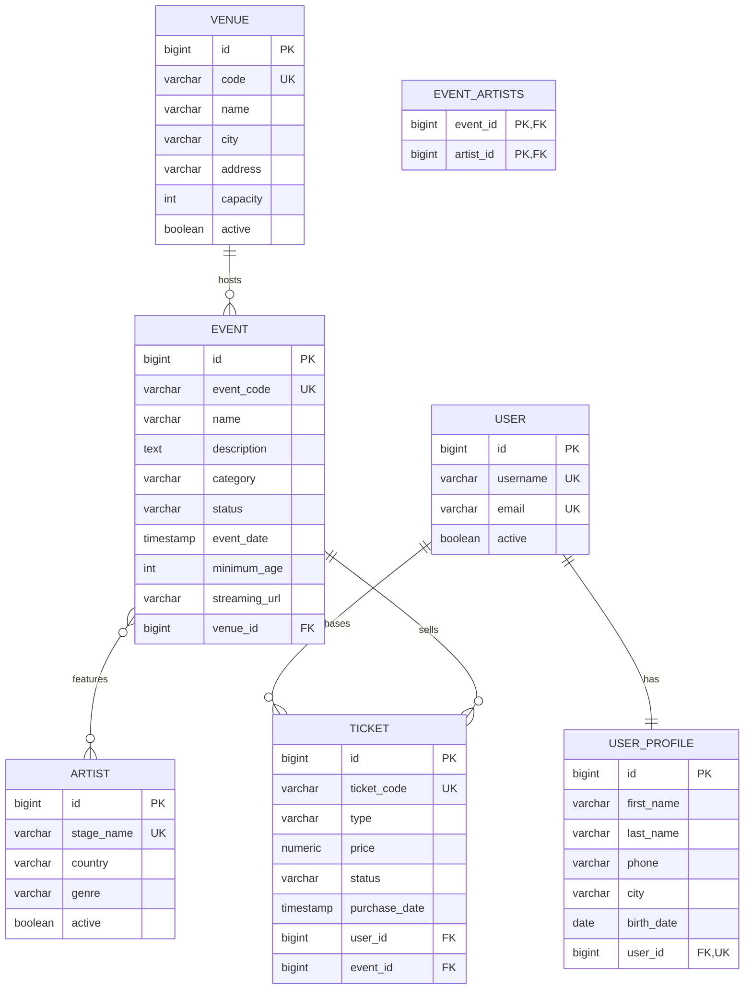

# PulsePass — Capa de Persistencia

Plataforma de descubrimiento de eventos y gestión de entradas.  
*Caso de estudio académico enfocado en el modelado relacional, persistencia JPA, migraciones con Flyway y pruebas de integración con Testcontainers y PostgreSQL real.*

---

## 1. Descripción del Proyecto
PulsePass es un núcleo de persistencia diseñado para administrar recintos (`Venue`), eventos (`Event`), artistas (`Artist`), usuarios (`User`), perfiles (`UserProfile`) y tickets (`Ticket`).  
El objetivo del proyecto es garantizar la integridad referencial y las reglas de negocio a nivel de base de datos (PostgreSQL), respaldado por entidades JPA estrictas, repositorios Spring Data y pruebas de integración que no dependen de bases de datos embebidas (sin H2).

---

## 2. Stack Tecnológico
- **Lenguaje:** Java 21
- **Framework:** Spring Boot 4.1.x
- **Persistencia:** Spring Data JPA / Hibernate 7.x
- **Base de Datos:** PostgreSQL
- **Control de Versiones de BD:** Flyway
- **Pruebas de Integración:** Testcontainers + JUnit Jupiter + AssertJ
- **Build Tool:** Maven (vía Maven Wrapper `mvnw`)

---

## 3. Modelo de Dominio y Relacional

### Relaciones Clave:
- **`Venue 1:N Event`**: Un recinto alberga múltiples eventos. Cada evento pertenece obligatoriamente a un venue.
- **`Event N:M Artist`**: Implementado mediante la tabla asociativa `event_artists` con clave primaria compuesta `(event_id, artist_id)`.
- **`User 1:1 UserProfile`**: Relación 1 a 1 reforzada en PostgreSQL mediante una restricción `UNIQUE` en la clave foránea `user_profiles.user_id`.
- **`User 1:N Ticket` & `Event 1:N Ticket`**: `Ticket` se modela como entidad de dominio propia (no un `@ManyToMany` simple), ya que almacena información transaccional (`ticketCode`, `type`, `price`, `status`, `purchaseDate`).



---

## 4. Estrategia de Migraciones con Flyway
La base de datos es la dueña de la integridad estructural. Hibernate está configurado en modo:
```yaml
spring.jpa.hibernate.ddl-auto: validate
```
Hibernate jamás crea ni altera tablas en tiempo de ejecución. Las migraciones se aplican en orden estricto desde `src/main/resources/db/migration`:

1. **`V1__create_schema.sql`**: Define el esquema base con PKs, FKs, constraints `UNIQUE` (`code`, `event_code`, `ticket_code`, `username`, `email`, `stage_name`, `user_id` en perfiles), `CHECK` (`capacity > 0`, `price >= 0`, catálogos de enums) e índices en claves foráneas y columnas de filtro.
2. **`V2__insert_initial_artists.sql`**: Inserta el catálogo inicial de artistas de prueba (*Solar Beat, Neon Waves, Caribbean Sound, Ocean Drive, Digital Pulse*).
3. **`V3__add_streaming_url_to_event.sql`**: Modificación incremental que agrega la columna `streaming_url VARCHAR(500)` a la tabla `events`, demostrando la evolución del esquema sin alterar migraciones previas.

---

## 5. Consultas Implementadas (Repositories)

### Spring Data Query Methods
- `VenueRepository.findByCode(String code)`
- `VenueRepository.existsByCode(String code)`
- `EventRepository.findByEventCode(String eventCode)`
- `EventRepository.findByStatusOrderByEventDateAsc(EventStatus status)`
- `EventRepository.findByVenueCode(String venueCode)`
- `ArtistRepository.findByStageName(String stageName)`
- `ArtistRepository.findByStageNameIgnoreCase(String stageName)`
- `UserRepository.findByUsername(String username)`
- `UserRepository.findByEmailIgnoreCase(String email)`
- `UserProfileRepository.findByUserEmailIgnoreCase(String email)`
- `TicketRepository.findByTicketCode(String ticketCode)`
- `TicketRepository.findByUserEmailIgnoreCase(String email)`
- `TicketRepository.findByUserEmailIgnoreCaseAndStatus(String email, TicketStatus status)`
- `TicketRepository.findByEventEventCodeAndStatus(String eventCode, TicketStatus status)`
- `TicketRepository.findByEventEventDateAfterOrderByEventEventDateAsc(OffsetDateTime date)`

### Consultas Personalizadas JPQL (`@Query`)
- **Eventos por Artista (`EventRepository.findByArtistStageName`):**  
  Navega la relación N:M entre `Event` y `Artist` usando `JOIN` y `DISTINCT` para evitar eventos duplicados.
- **Eventos por Ciudad y Artista (`EventRepository.findByCityAndArtist`):**  
  Filtra eventos navegando hacia `Venue.city` y `Artist.stageName` de manera case-insensitive.
- **Eventos Recomendados (`EventRepository.findRecommendedEvents`):**  
  Consulta combinada con filtros de estado (`PUBLISHED`), eventos futuros posteriores a una fecha dada, ciudad y coincidencia parcial (`LIKE`) en el nombre artístico, ordenada cronológicamente.
- **Conteo de Tickets Pagados (`TicketRepository.countByEventCodeAndStatus`):**  
  Cálculo optimizado de ventas confirmadas utilizando la función de agregación `COUNT(t)`.

---

## 6. Pruebas de Integración y Testcontainers
Las pruebas de integración en `PulsePassPersistenceIntegrationTest` se ejecutan contra un contenedor real de PostgreSQL levantado automáticamente mediante **Testcontainers** y `@ServiceConnection`.

### Aspectos Verificados:
- Aplicación completa de migraciones Flyway (`V1`, `V2`, `V3`).
- Validación estricta del esquema por Hibernate (`validate`).
- Correcto funcionamiento de asociaciones 1:N, 1:1 y N:M.
- Comportamiento de Query Methods y consultas JPQL avanzadas.
- Integridad de restricciones: se valida que al intentar persistir registros duplicados (como `ticketCode`), PostgreSQL y Spring Data lanzan `DataIntegrityViolationException` de manera inmediata al invocar `saveAndFlush()`.

---

## 7. Instrucciones de Ejecución

### Prerrequisitos
- Java 21 instalado.
- Docker Desktop en ejecución (requerido por Testcontainers).

### Ejecutar las Pruebas de Integración
En la raíz del proyecto, ejecutar:

**En Windows (PowerShell / CMD):**
```powershell
.\mvnw.cmd clean test
```

**En Linux / macOS:**
```bash
./mvnw clean test
```
